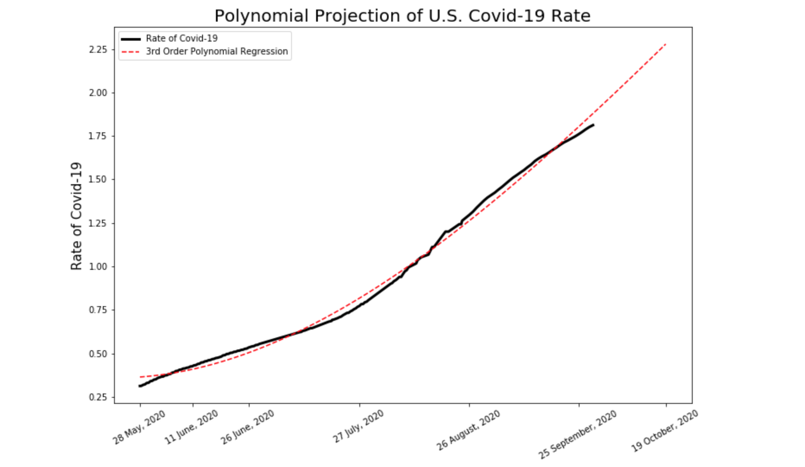

# Rate of Covid-19 by Country
Tracking the rate of Covid-19 on a Raspberry Pi

The rate of Covid of 22 countries is determined from total cases divided by country population. The data is wrangled with Pandas. The script is run every 12 hours and stores the rates by country in a .csv. 

Jupyter notebooks is used to graph Covid rates over time. The first notebook graphs 19 countries using matplotlib. The second notebook takes the Covid rate of the U.S. and applies both linear and third order polynomial regression to investigate the trends in the rate. Root Mean Squared Error is calculated to give a comparison of linear and polynomial best fit lines.
## Credits
Sources for daily Covid counts are taken from the [Our World In Data](https://covid.ourworldindata.org/data/owid-covid-data.json) API. Country populations are taken from [WorldOMeters](https://www.worldometers.info/world-population/population-by-country/).

## License
MIT License

Copyright (c) 2020 Joseph Perry

Permission is hereby granted, free of charge, to any person obtaining a copy
of this software and associated documentation files (the "Software"), to deal
in the Software without restriction, including without limitation the rights
to use, copy, modify, merge, publish, distribute, sublicense, and/or sell
copies of the Software, and to permit persons to whom the Software is
furnished to do so, subject to the following conditions:

The above copyright notice and this permission notice shall be included in all
copies or substantial portions of the Software.

THE SOFTWARE IS PROVIDED "AS IS", WITHOUT WARRANTY OF ANY KIND, EXPRESS OR
IMPLIED, INCLUDING BUT NOT LIMITED TO THE WARRANTIES OF MERCHANTABILITY,
FITNESS FOR A PARTICULAR PURPOSE AND NONINFRINGEMENT. IN NO EVENT SHALL THE
AUTHORS OR COPYRIGHT HOLDERS BE LIABLE FOR ANY CLAIM, DAMAGES OR OTHER
LIABILITY, WHETHER IN AN ACTION OF CONTRACT, TORT OR OTHERWISE, ARISING FROM,
OUT OF OR IN CONNECTION WITH THE SOFTWARE OR THE USE OR OTHER DEALINGS IN THE
SOFTWARE. 

